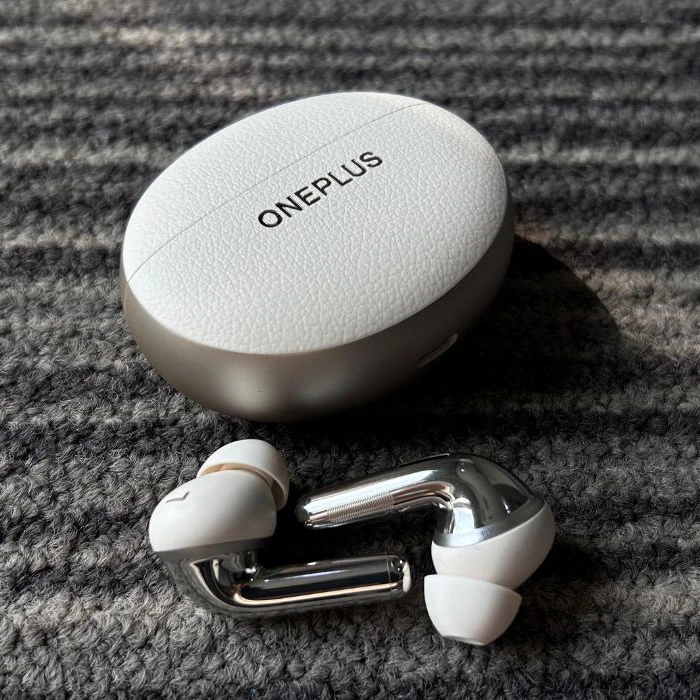

# Product_card
## Date: 09/07/2025 
## Objective:

To replicate a product card layout similar to those found on real-time e-commerce platform like FlipKart using the CSS Box Model (margin, border, padding, and content).

## Tasks:

#### 1. Structure the HTML Layout:
Create a container ```<div>``` for the product card.

Add an `````` for the product image.

Include ```<h2>``` for product name, ```<p>``` for description, and a ```<span>``` or ```<div>``` for price.

Add a “Buy Now” or “Add to Cart” button.

#### 2. Apply Box Model Styling in CSS:
Use padding inside each section (image, text, button) to ensure readability.

Use margin around the card to space it from the page edges or other cards.

Add a border to outline the card.

Control width and height for consistent sizing.

#### 3. Visual Styling:
Add a background color to the card container.

Use box-shadow to simulate depth (card lifting effect).

Add border-radius for rounded corners.

#### 4. Center the Card:
Use display: flex and justify-content: center and align-items: center on the parent container.

#### 5. Bonus Enhancements:
Use a hover effect on the button (e.g., background color change).

Make the card responsive with percentage-based widths or media queries.
## HTML Code:
```
<!DOCTYPE html>
<html lang="en">
<head>
    <meta charset="UTF-8">
    <meta name="viewport" content="width=device-width, initial-scale=1.0">
    <title>Flipkart - Product Card</title>
    <link rel="stylesheet" href="style.css">
</head>
<body>
    <h1>Flipkart - Products</h1>
    <section class="container">
        <div class="card">
            
            <div class="product-des">
                <h2>Oneplus Buds 3 pro</h2>
                <p>Experience immersive sound with OnePlus Buds 3 Pro, featuring smart adaptive noise cancellation and crystal-clear audio. Enjoy up to 44 hours of battery life with fast charging for uninterrupted listening.</p>
                <div class="price-container">
                    <span>PRICE : ₹11,999</span>
                    <button type="submit">Add to cart</button>
                </div>
            </div>
        </div>
        <div class="card">
            
            <div class="product-des">
                <h2>Lenovo LOQ 15</h2>
                <p>Powerful gaming meets sleek design with the Lenovo LOQ 15—packing an Intel Core i7/RTX 4060 combo, 15.6″ high‑refresh display, customizable RGB keyboard, enhanced cooling, and immersive audio features.</p>
                <div class="price-container">
                    <span>PRICE : ₹99,999</span>
                    <button type="submit">Add to cart</button>
                </div>
            </div>
        </div>
        <div class="card">
            
            <div class="product-des">
                <h2>Apple Watch Series 7</h2>
                <p>Apple Watch Series 7 features a larger always-on Retina display with crack-resistant glass and IP6X dust resistance. It includes ECG, SpO₂ monitoring, sleep tracking, and fast charging for all-day health and fitness use.</p>
                <div class="price-container">
                    <span>PRICE : ₹49,999</span>
                    <button type="submit">Add to cart</button>
            </div>
        </div>
    </section>
</body>
</html>
```
## CSS Code:
```
body{
    margin: 0;
    text-align: center;
    background: linear-gradient(to bottom, #E4DFFF, #f1edff);
    display: flex;
    flex-direction: column;
    align-items: center;
    font-family:'Segoe UI', Tahoma, Geneva, Verdana, sans-serif;
    padding: 0;
    height: 100vh;
}

.container{
    display: flex;
    flex-direction: row;
    justify-content: space-around;
    width: 90%;
    margin-top: 100px;
}

h2{
    margin: 0;
    color: #5E5689;
}

img{
    width: 100%;
    height: 200px;
    border-radius: 10px;
    border-bottom-left-radius: 0;
    border-bottom-right-radius: 0;
}

.card{
    width: 300px;
    border-radius: 10px;
    background-color: white;
    text-align: left;
    box-shadow: 0 4px 16px rgba(94, 86, 137, 0.15);
}

.card:hover{
    transform: translateY(-10px);
    transition: transform 0.5s;
}

.product-des{
    padding: 0 10px 10px 10px;
    border-radius: 10px;
}

.product-des p{
    text-align: justify;
    color:#6F6F6F;  
}

.product-des span{
    font-weight: 700;
    color: rgb(79, 77, 77);
}

.price-container{
    display: flex;
    justify-content: space-between;
    align-items: center;
}

button{
    width: 45%;
    height: 40px;
    background-color: #5E5689;
    color: white;
    border-radius: 5px;
    border: none;
}

button:hover{
    background-color: #807b9a;
    cursor: pointer;
}

/* media query for mobile */
@media (max-width: 768px) {
    .container{
        flex-direction: column;
        align-items: center;
        gap: 20px;
        margin-top: 0;
    }

    .card{
        width: 82%;
    }
}
```
## Output:
## Desktop : 


## Mobile : 


## Result:
A product card layout similar to those found on real-time e-commerce platform like FlipKart using the CSS Box Model is replicated successfully.
